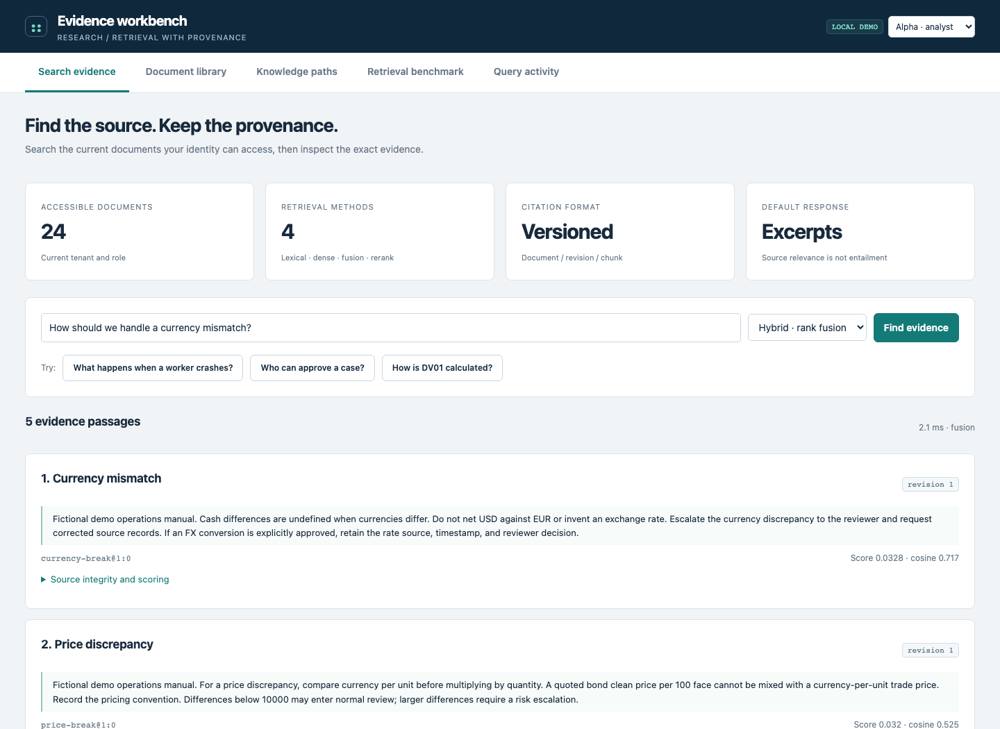
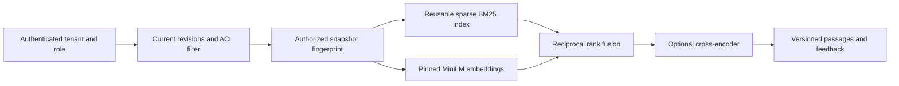
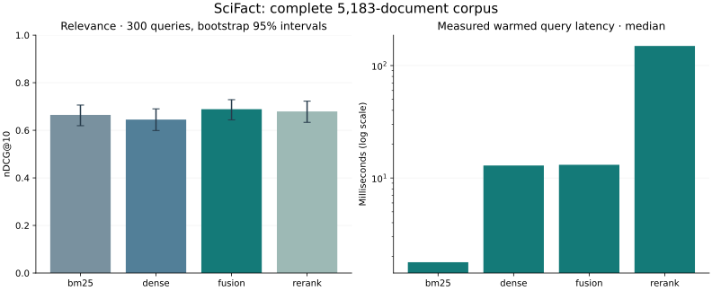

# Evidence workbench

[](https://github.com/christianwhollar/evidence-workbench/actions/workflows/ci.yml)

A document research service with a browser for evidence search, revision history, access changes, and provenance-bearing graph paths. Retrieval methods are evaluated on a complete public benchmark, not only on the bundled demo documents.



## Start locally

Python 3.12 is the tested runtime. From this repository:

```bash
python3.12 -m venv .venv
source .venv/bin/activate
pip install -c constraints.txt -e '.[dev]'
python -m evidence.serve --demo
```

Open **http://127.0.0.1:8102**. Demo mode binds to loopback and exposes explicit analyst/reviewer identities for synthetic data. It is opt-in; use configured credentials for a hosted service. Interactive API documentation is at `/docs`.

## Use the workbench

**Search evidence** returns exact passages with document IDs, revisions, chunk IDs, and text hashes. Scores rank passages; they are not answer-confidence estimates. Feedback is recorded against a query event whose raw text is not retained.

**Document library** lets a reviewer add, revise, restrict, or delete documents. Historical revisions are immutable. Current access and historical revision permissions are both required to view history. A revocation immediately changes the authorized snapshot used by search.

**Knowledge paths** traverses curated relationships. Every edge includes its source document and revision. The service does not invent missing relationships or treat reachability as entailment.

The local demo contains 24 fictional operations policies and one reviewer-only document. Switch to the reviewer identity to see the restricted document, then revoke analyst access to an ordinary policy and repeat a search.

## Retrieval architecture



The newer index reuses its fitted lexical matrix and cached embeddings rather than refitting on every request. Snapshot keys include the tenant, role, complete document content and revision metadata. Model revisions are pinned. The process cache is bounded. Revoked text cannot affect the next authorized snapshot.

The optional PostgreSQL/pgvector adapter remains available through the `transformer` API method. It applies a current authorized chunk allowlist inside the vector query, so a stale vector index cannot restore revoked access.

## Complete public benchmark

The study evaluates **all 300 SciFact test queries against 5,183 documents**, using the official BEIR qrels. It downloads a checksummed archive and compares BM25, MiniLM, rank fusion, and cross-encoder reranking without fitting on SciFact labels.

| Method | nDCG@10 | Recall@10 | Measured p50 |
|---|---:|---:|---:|
| BM25 | 0.6647 | 0.7849 | 1.8 ms |
| MiniLM | 0.6451 | 0.7833 | 12.9 ms |
| Rank fusion | **0.6887** | **0.8329** | 13.1 ms |
| Fusion + reranker | 0.6793 | 0.8083 | 149.4 ms |

Fusion is the strongest measured relevance/latency tradeoff in this run. The reranker adds substantial work and does not beat fusion. Timings describe warmed local execution and exclude model loading and initial index construction.

```bash
pip install -c constraints.txt -e '.[research]'
python -m evidence.serve --demo --neural
python -m evidence.benchmark --output runtime/scifact-study
```

[Protocol and aggregate results](reports/scifact-v1/report.json) · [Every query result](reports/scifact-v1/queries.jsonl) · [Benchmark implementation](src/evidence/benchmark.py)

This is scientific-abstract retrieval, not evidence of financial-domain answer accuracy. Qrels measure document relevance, not whether a generated claim is supported. Optional router-based generation validates citation IDs and output structure but does not claim entailment verification.

## Deployment

`docker compose up --build` runs the seeded lexical browser. Neural retrieval is an optional installation because it downloads local model weights. `compose.pgvector.yaml` starts a separate local vector database. The main metadata store remains SQLite; this implementation does not claim a distributed ingestion scheduler or large-corpus search cluster.

References: [BEIR](https://github.com/beir-cellar/beir), [SciFact](https://github.com/allenai/scifact), [MiniLM model](https://huggingface.co/sentence-transformers/all-MiniLM-L6-v2), [cross-encoder model](https://huggingface.co/cross-encoder/ms-marco-TinyBERT-L2-v2). The corpus is downloaded at runtime; benchmark data is not bundled into the repository.




The live three-service verification passed with actual Ollama responses, authorized policy retrieval, independent review enforcement and settled usage reservations. [Recorded connected workflow](reports/integration-v2.json).

## Validation and project notes

```bash
pytest -q
ruff check src tests scripts
```

[Architecture and decisions](docs/design.md) · [Operating guide](docs/operations.md) · [Verification record](docs/verification.md) · [Development provenance](DEVELOPMENT.md)

This is a finished local portfolio application with reproducible experiments and recorded limitations. It does not claim prior production deployment or substitute for operating experience.
